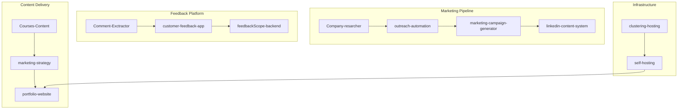

# Team Activity Analysis

> Generated: 2025-12-09
> Based on: Recent commit activity across all accessible repositories

---

## Team Member Activity Summary

### @Jonathan (CTO - Backend, Hosting, Architecture)

**Most Active Projects (by recent commits):**

| Project | Last Activity | Focus Area | Status |
|---------|---------------|------------|--------|
| **Taller_Ocampos** | Dec 7, 2025 | Client project - Auto repair shop | 🟢 Active |
| **yt-transcript-headless** | Dec 4, 2025 | YouTube transcript extraction | 🟢 Active |
| **agentic-schemas** | Nov 12, 2025 | AI design patterns visualization | 🟡 Recent |
| **Company-Information** | Oct 24, 2025 | Multi-agent orchestration | 🟠 Semi-Active |
| **work-hours-automated-reports** | Oct 16, 2025 | Time tracking automation | 🟠 Semi-Active |
| **WPG-Amenities** | Sep 30, 2025 | Client website | 🔴 Dormant |

**Recent Commit Types:**
- `docs:` Documentation and guides
- `feat:` New features (channel extraction, multi-agent)
- `fix:` Bug fixes (Chromium crashes, paths)
- `refactor:` Code organization

---

### @Kyrian (PM - Outreach, Client Investigation)

**Most Active Projects (by recent commits):**

| Project | Last Activity | Focus Area | Status |
|---------|---------------|------------|--------|
| **marketing-strategy** | Dec 4, 2025 | Marketing templates and strategy | 🟢 Active |
| **Courses-Content** | Dec 2, 2025 | Training course development | 🟢 Active |

**Recent Commit Types:**
- `docs:` AI tool configurations
- `refactor:` Course reorganization
- `feat:` New course modules (AI for Sales)
- Content and template updates

---

### @Ivan (Tools - Scrapers, Analyzers, Automation)

**Most Active Projects (by recent commits):**

| Project | Last Activity | Focus Area | Status |
|---------|---------------|------------|--------|
| **team-tasks** | Nov 24, 2025 | Task backlog organization | 🟡 Recent |

**Recent Commit Types:**
- Workflow documentation
- Backlog organization
- Task management

**Note:** Limited visibility into private repos. Ivan likely active on:
- Comment-Exctractor (scraping tools)
- customer-feedback-app (analysis)
- outreach-automation (automation)

---

## Current Active Projects by Priority

### Tier 1: Active Client/Product Work
| Project | Owner | Last Activity | Priority |
|---------|-------|---------------|----------|
| **Taller_Ocampos** | @Jonathan | Dec 7 | High - Client deliverable |
| **yt-transcript-headless** | @Jonathan | Dec 4 | High - Product/Tool |
| **marketing-strategy** | @Kyrian | Dec 4 | High - Business development |
| **Courses-Content** | @Kyrian | Dec 2 | High - Revenue stream |

### Tier 2: Internal Tools & Infrastructure
| Project | Owner | Last Activity | Priority |
|---------|-------|---------------|----------|
| **team-tasks** | @Ivan | Nov 24 | Medium - Team coordination |
| **agentic-schemas** | @Jonathan | Nov 12 | Medium - Knowledge base |
| **Company-Information** | @Jonathan | Oct 24 | Medium - Infrastructure |

### Tier 3: Dormant/Needs Attention
| Project | Owner | Last Activity | Action Needed |
|---------|-------|---------------|---------------|
| **WPG-Amenities** | @Jonathan | Sep 30 | Client status check |
| **AI-Whisperers-Website** | - | Sep 16 | Archive decision |
| **work-hours-automated-reports** | @Jonathan | Oct 16 | Maintenance mode |

---

## Workload Analysis

### Current Distribution

```
@Jonathan:  ████████████████████  (6 active projects)
@Kyrian:    ████████              (2 active projects)
@Ivan:      ████                  (1 visible + private repos)
```

### Observations

1. **@Jonathan is overloaded** - Primary developer on most technical projects
2. **@Kyrian focused on content** - Marketing and courses aligned with PM role
3. **@Ivan visibility limited** - Token doesn't show private repo activity
4. **Client work prioritized** - Taller_Ocampos getting active development

---

## Recommended Task Priorities

Based on current activity and project status:

### Immediate (This Week)
| Task | Assignee | Rationale |
|------|----------|-----------|
| Complete Taller_Ocampos documentation | @Jonathan | Active client project |
| Finalize marketing-strategy templates | @Kyrian | Business development |
| Map Comment-Extractor integration | @Ivan | Enable feedback platform |

### Short-term (Next 2 Weeks)
| Task | Assignee | Rationale |
|------|----------|-----------|
| Website consolidation (TASK-011) | @Jonathan | Reduce maintenance burden |
| Course content completion | @Kyrian | Revenue enablement |
| Outreach automation testing | @Ivan | Marketing pipeline support |

### Medium-term (This Month)
| Task | Assignee | Rationale |
|------|----------|-----------|
| Infrastructure documentation | @Jonathan | Knowledge transfer |
| WPG-Amenities status decision | @Jonathan | Client clarity |
| Team-tasks integration with this repo | @Ivan | Single source of truth |

---

## Cross-Project Dependencies



---

## Recommended New Rules

Based on this analysis, see [07-activity-tracking.md](../rules/07-activity-tracking.md) for new rules 61-70.
