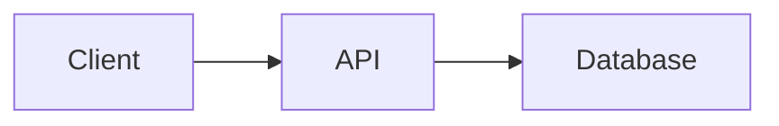

# Rules 71-80: Documentation Standards

Standards for creating and maintaining project documentation.

---

## Rule 71: README Requirements

Every repository MUST have a README.md with:
- **Title**: Clear project name
- **Description**: What it does (1-2 sentences)
- **Setup**: How to install/run
- **Usage**: Basic examples
- **Status**: Active/Dormant/Archived badge

**Minimum viable README:**
```markdown
# Project Name
Brief description of what this does.

## Setup
npm install / pip install / etc.

## Usage
Basic command or example.

## Status

```

---

## Rule 72: CLAUDE.md Files

AI-assisted repositories MUST include CLAUDE.md with:
- Project context and purpose
- Key architectural decisions
- Important files and their roles
- Known issues or gotchas
- Do NOT include: personal notes, passwords, sensitive data

**Template:**
```markdown
# Project Context
[What this project does and why]

## Architecture
[Key design decisions]

## Important Files
- `src/main.ts` - Entry point
- `config/` - Configuration files

## Notes for AI
[Helpful context for AI assistants]
```

---

## Rule 73: Changelog Maintenance

Projects with releases MUST maintain CHANGELOG.md:
- Use [Keep a Changelog](https://keepachangelog.com/) format
- Group by: Added, Changed, Deprecated, Removed, Fixed, Security
- Date format: YYYY-MM-DD
- Link to version tags when applicable

---

## Rule 74: Code Comments

Comment code when:
- Logic is non-obvious
- Business rules are implemented
- Workarounds or hacks exist
- External dependencies have quirks

Do NOT comment:
- Self-explanatory code
- Every function (use descriptive names instead)
- Obvious operations

**Good:** `// Retry 3 times due to flaky API rate limits`
**Bad:** `// increment counter` for `counter++`

---

## Rule 75: API Documentation

APIs MUST document:
- All endpoints with HTTP method
- Request/response schemas
- Authentication requirements
- Error codes and meanings
- Rate limits if applicable

Use OpenAPI/Swagger for REST, or inline docs for internal APIs.

---

## Rule 76: Inline Documentation Updates

When modifying code:
- Update related comments
- Update README if behavior changes
- Update CHANGELOG for user-facing changes
- Remove outdated documentation

**Rule:** Documentation debt is treated as technical debt.

---

## Rule 77: Diagram Requirements

Complex systems require diagrams:
- Architecture diagrams for multi-service systems
- Data flow diagrams for pipelines
- Use Mermaid for version-controlled diagrams
- Update diagrams when architecture changes

**Mermaid example:**


---

## Rule 78: Decision Records

Major decisions MUST be documented:
- Create ADR (Architecture Decision Record) for architectural choices
- Include: Context, Decision, Consequences
- Store in `docs/decisions/` or project wiki
- Reference ADR numbers in related code

**ADR Template:**
```markdown
# ADR-001: Use PostgreSQL for data storage

## Context
Need persistent storage for user data.

## Decision
Use PostgreSQL over MongoDB.

## Consequences
- Need to manage migrations
- Strong consistency guaranteed
```

---

## Rule 79: Documentation Review

Documentation is reviewed:
- During PR reviews (check for doc updates)
- Monthly for accuracy (part of retrospective)
- When onboarding new team members (identify gaps)

**Checklist:**
- [ ] README accurate?
- [ ] Setup instructions work?
- [ ] API docs match implementation?
- [ ] No broken links?

---

## Rule 80: Documentation Ownership

Each document has an owner:
- README.md → Repository owner
- API docs → Backend developer
- User guides → PM (@Kyrian)
- Architecture docs → CTO (@Jonathan)

Owners are responsible for keeping docs current.

---

## Quick Reference

| Rule | Topic | Key Point |
|------|-------|-----------|
| 71 | README | Required sections for all repos |
| 72 | CLAUDE.md | AI context files (no personal data) |
| 73 | Changelog | Keep a Changelog format |
| 74 | Comments | Non-obvious logic only |
| 75 | API Docs | Endpoints, schemas, auth, errors |
| 76 | Updates | Update docs with code changes |
| 77 | Diagrams | Mermaid for complex systems |
| 78 | ADRs | Document major decisions |
| 79 | Reviews | Monthly accuracy checks |
| 80 | Ownership | Assigned doc maintainers |
